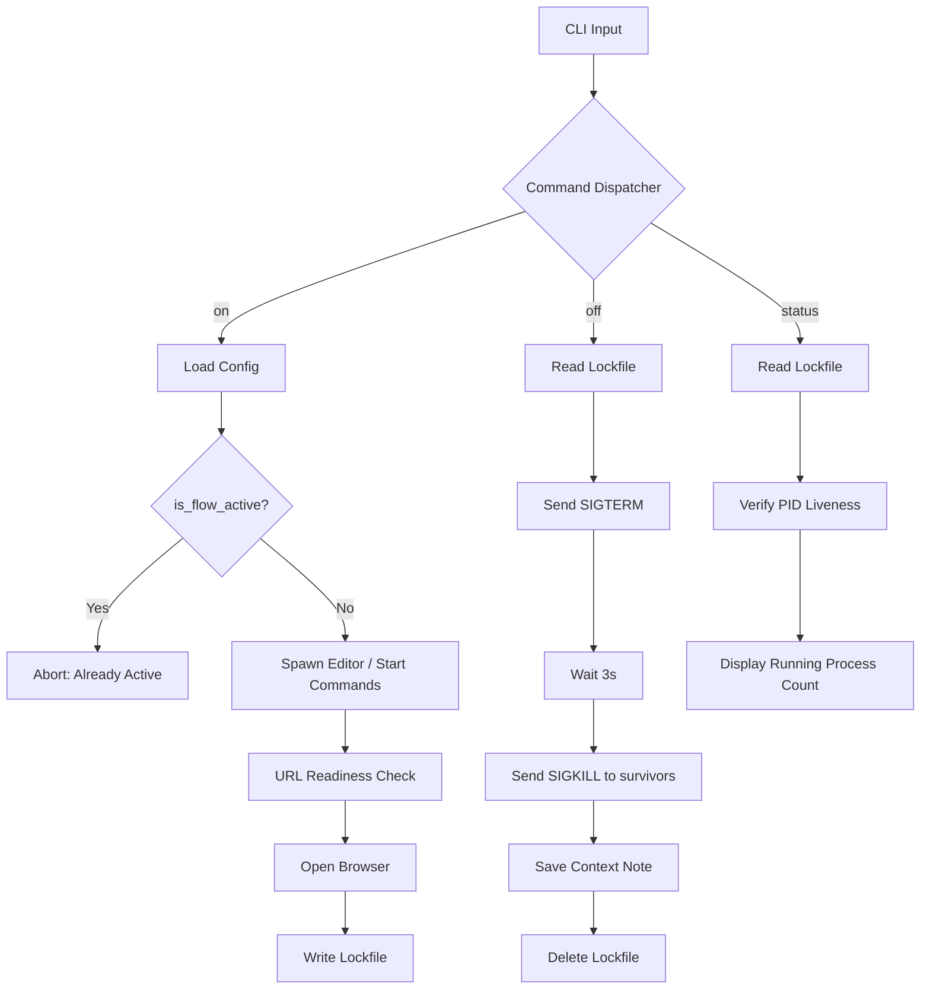

# Progflow: Developer Documentation and Technical Specification

This document provides a comprehensive technical overview of the Progflow architecture, internal logic, and operational workflows. It is intended for developers seeking to contribute to the project or integrate its capabilities into larger systems.

## Architecture Overview

Progflow is architected as a modular, stateless CLI utility written in Rust. It prioritizes deterministic behavior, minimal resource overhead, and cross-platform compatibility without reliance on an asynchronous runtime.

### Core Modules

- **`main.rs`**: Entry point. Utilizes the `clap` crate for declarative argument parsing and command dispatching.
- **`config.rs`**: Data layer. Manages serialization/deserialization of `FlowConfig`, filesystem interactions in XDG-compliant directories, and the lockfile mechanism for process synchronization.
- **`platform.rs`**: Abstraction layer. Encapsulates environment detection (Termux vs. Desktop vs. macOS) and provides normalized interfaces for system-level operations like resource invocation (e.g., `xdg-open` vs. `open`).
- **`tips.rs`**: Utility module. Provides context-aware operational heuristics based on event triggers and host OS metadata.
- **`commands/`**: Implementation layer. Each subcommand (`on`, `off`, `new`, etc.) is encapsulated in its own module to ensure high cohesion and low coupling.

## Process Lifecycle and Orchestration

Progflow manages the lifecycle of development environments through a deterministic state machine.

### Activation Flow (`progflow on`)

1. **Lock Verification**: The utility checks for an existing `.lock` file. If present, it verifies PID liveness via `kill -0`. If PIDs are active, activation is aborted to prevent state corruption.
2. **Resource Preparation**: Normalizes the working directory and environment variables.
3. **Parallel Spawning**:
   - Spawns the configured editor using `sh -c` and `setsid` (on Unix) to detach it from the parent CLI process.
   - Iterates through `start_commands`, redirecting standard output and error streams to specific log files in the `~/.config/flow/logs/` directory.
4. **Network Validation**: For local URLs, the utility performs synchronous TCP handshakes with a 3-second timeout before invoking the platform's browser interface.
5. **State Synchronization**: Writes the PIDs of all successfully spawned processes to the `.lock` file.

### Termination Flow (`progflow off`)

1. **State Retrieval**: Reads PIDs from the `.lock` file.
2. **Tiered Termination**:
   - **Phase 1 (SIGTERM)**: Delivers `SIGTERM` to all tracked PIDs to request graceful shutdown.
   - **Phase 2 (Latent Wait)**: Implements a mandatory 3-second delay to allow for resource cleanup.
   - **Phase 3 (SIGKILL)**: Verifies liveness via `kill -0` and delivers `SIGKILL` to any remaining processes.
3. **Cleanup**: Removes the `.lock` file and persists any terminal context notes to the primary configuration file.

## Technical Flowchart

## Data Specification

### Configuration Schema (`FlowConfig`)

Configurations are persisted as JSON objects.

| Field | Description | Type |
| :--- | :--- | :--- |
| `name` | Unique flow identifier | `String` |
| `directory` | Target filesystem path | `Option<String>` |
| `editorCmd` | Shell command for IDE invocation | `Option<String>` |
| `urlList` | Array of resources for browser invocation | `Option<Vec<String>>` |
| `shell` | Path to preferred shell interpreter | `String` |
| `env` | Key-value pairs for environment injection | `HashMap<String, String>` |
| `startCommands` | List of `StartCommand` objects | `Vec<StartCommand>` |
| `lastNote` | Persistent state from the previous session | `Option<String>` |

### StartCommand Object

| Field | Description | Type |
| :--- | :--- | :--- |
| `command` | Executable shell command | `String` |
| `workingDirectory` | Context path for execution | `Option<String>` |
| `env` | Local environment overrides | `HashMap<String, String>` |
| `background` | Detachment flag | `bool` |

## Error Handling Paradigm

Progflow utilizes a custom `AppError` enum to categorize and normalize failures across the system.

- **`User`**: Input validation or operational state errors (e.g., flow already active). Includes recovery suggestions.
- **`Io`**: Filesystem or process spawning failures. Captures both the OS error and the target path.
- **`Json`**: Serialization or schema mismatch errors.
- **`Config`**: Semantic errors within a valid JSON configuration.

## Testing Strategy

The project implements a rigorous integration testing suite in `tests/integration_test.rs`. These tests execute the compiled binary in an isolated environment to verify:

1. **End-to-End Workflows**: Sequential creation, activation, and termination cycles.
2. **Process Integrity**: Verification that background processes are correctly spawned and reclaimed.
3. **Non-Interactive Robustness**: Ensuring all features function via CLI flags and piped input.
4. **State Persistence**: Confirming notes and configuration updates survive session transitions.

Developers must run `cargo test --release` to ensure compliance before submitting changes.

---

Technical Support: [GitHub Issues](https://github.com/Rehanasharmin/Progflow/issues)
License: MIT
