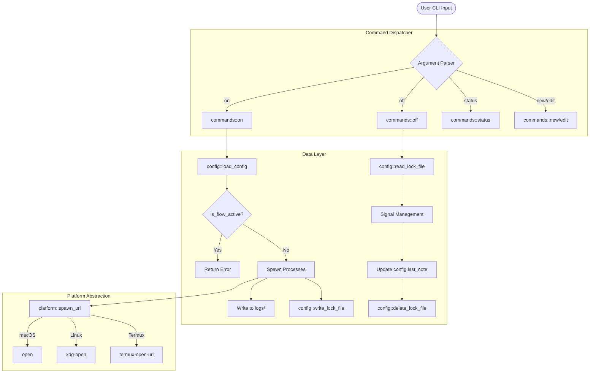

# Progflow: Developer Documentation and Technical Specification

This document provides a comprehensive technical overview of the Progflow architecture, internal logic, and operational workflows. It is intended for developers seeking to contribute to the project or integrate its capabilities into larger systems.

## Architecture Overview

Progflow is architected as a modular, stateless CLI utility written in Rust. It prioritizes deterministic behavior, minimal resource overhead, and cross-platform compatibility without reliance on an asynchronous runtime.

### Project Module Map

| Module | Responsibility | Technical Details |
| :--- | :--- | :--- |
| **`main.rs`** | Entry Point | Manages CLI dispatching via `clap`. Implements global `ExitCode` mapping. |
| **`config.rs`** | Data Abstraction | Handles JSON serialization via `serde`. Manages PID synchronization in `.lock` files. |
| **`platform.rs`** | OS Abstraction | Normalizes cross-platform behavior for Linux, macOS, and Termux environments. |
| **`tips.rs`** | User Intelligence | Selects contextual operational heuristics based on platform and event triggers. |
| **`stats.rs`** | Analytics Logic | Computes session durations and aggregate usage telemetry. |
| **`aliases.rs`** | Shell Integration | Generates POSIX-compliant shell aliases for flow orchestration. |
| **`error.rs`** | Fault Management | Implements custom `AppError` enum with `std::fmt::Display` for consistent error reporting. |
| **`commands/`** | Subcommand Logic | Discrete implementation modules for each atomic operation (`on`, `off`, `update`, etc.). |

## Process Lifecycle and Orchestration Logic

Progflow manages the lifecycle of development environments through a deterministic state machine and tiered process management.

### Activation Workflow (`progflow on`)

The activation sequence is designed to be atomic and failure-aware:

1. **Mutual Exclusion Check**: Invokes `is_flow_active()`. If a lockfile exists, it performs a `kill -0` check on stored PIDs. Active PIDs trigger an immediate abort with a user-facing error to prevent concurrent instance conflicts.
2. **Session Recording**: Captures the current timestamp (ISO 8601) and updates the `last_activated` field in the flow configuration.
3. **Environment Ingestion**: Merges the global system environment with the flow's specific `env` HashMap.
4. **Execution Context**: Changes the working directory to the flow's root. If unspecified, it defaults to the current directory of the caller.
5. **Process Detachment**: 
   - IDEs and start commands are spawned using `sh -c`.
   - On Unix systems, `setsid()` is invoked via `pre_exec` to create a new session, effectively detaching the child process from the parent terminal.
   - For background processes, standard output and error streams are redirected to an append-only log file in `~/.config/flow/logs/<name>.log`.
6. **Connectivity Verification**: Localhost/127.0.0.1 URLs undergo a `TcpStream::connect_timeout` check (3s). A failure does not block execution but generates a warning telemetry event.
7. **PID Persistence**: Writes all successfully spawned PIDs and the session start time to `~/.config/flow/<name>.lock`.

### Termination Workflow (`progflow off`)

The termination sequence prioritizes graceful reclamation of resources and telemetry accuracy:

1. **Duration Calculation**: Compares the current timestamp against the `start_time` stored in the lockfile. The delta is added to the flow's `total_seconds` and the `session_count` is incremented.
2. **Signal Delivery (Phase 1)**: Iterates through PIDs in the lockfile and sends `SIGTERM`. This allows processes (like databases or complex servers) to perform cleanup or state persistence.
3. **Latent Synchronization**: A 3-second thread sleep is implemented to allow processes time to respond to `SIGTERM`.
4. **Forced Reclamation (Phase 2)**: Re-verifies PID liveness via `kill -0`. Remaining processes are sent `SIGKILL` to ensure complete termination.
5. **State Finalization**: Captures context notes and persists them to the primary JSON configuration. Deletes the lockfile.

### Update Workflow (`progflow update`)

The self-update mechanism leverages the primary installation script:

1. **Automation Trigger**: The binary invokes a remote `curl | bash` pipeline.
2. **Flag Injection**: Passses the `update` argument, which sets the `FORCE_INSTALL` internal flag in `install.sh`.
3. **Atomic Reinstallation**: The script fetches the latest source, builds a release binary, and performs an atomic overwrite of the existing executable.

## Technical Architecture Flowchart



## Internal Data Specifications

### Filesystem Hierarchy

Progflow adheres to the XDG Base Directory Specification:

- **Config**: `~/.config/flow/<name>.json`
- **Locks**: `~/.config/flow/<name>.lock`
- **Logs**: `~/.config/flow/logs/<name>.log`

### Core Schema Definition

```rust
pub struct FlowConfig {
    pub name: String,                    // Primary Identifier
    pub directory: Option<String>,        // Root execution path
    pub editor_cmd: Option<String>,       // Integrated IDE command
    pub url_list: Option<Vec<String>>,    // Web resource array
    pub shell: String,                   // Command interpreter path
    pub env: HashMap<String, String>,     // Global environment overrides
    pub start_commands: Vec<StartCommand>, // Background service definitions
    pub last_note: Option<String>,        // Persistent session state
}
```

## Error Handling and Diagnostics

Progflow implements a robust error handling strategy using the `AppError` type. This ensures that failures are captured with maximum context (paths, OS error codes, and semantic reason) and reported to the user with actionable remediation steps.

| Error Variant | Cause | User Impact |
| :--- | :--- | :--- |
| `User` | Semantic/Logical error | Blocked execution; provided with suggestion. |
| `Io` | Filesystem/OS failure | Technical diagnostic reported; exit code 2. |
| `Json` | Data corruption | Configuration rejected; requires manual fix. |
| `Config` | Validation failure | Prevented invalid state entry. |

## Development and Testing Standards

### Automated Validation
The integration suite in `tests/integration_test.rs` is mandatory for all changes. It utilizes the `Command` API to simulate real-world usage patterns across the entire subcommand spectrum.

### Contribution Guidelines
1. **Idiomatic Rust**: Adhere to standard Rust naming conventions and safety patterns.
2. **Minimal Dependencies**: Any new dependency must be vetted for size and security impact.
3. **Platform Parity**: Features must be verified on at least two of the three primary target platforms (Linux, macOS, Termux).

---

Technical Support: [GitHub Issues](https://github.com/Rehanasharmin/Progflow/issues)
License: MIT
